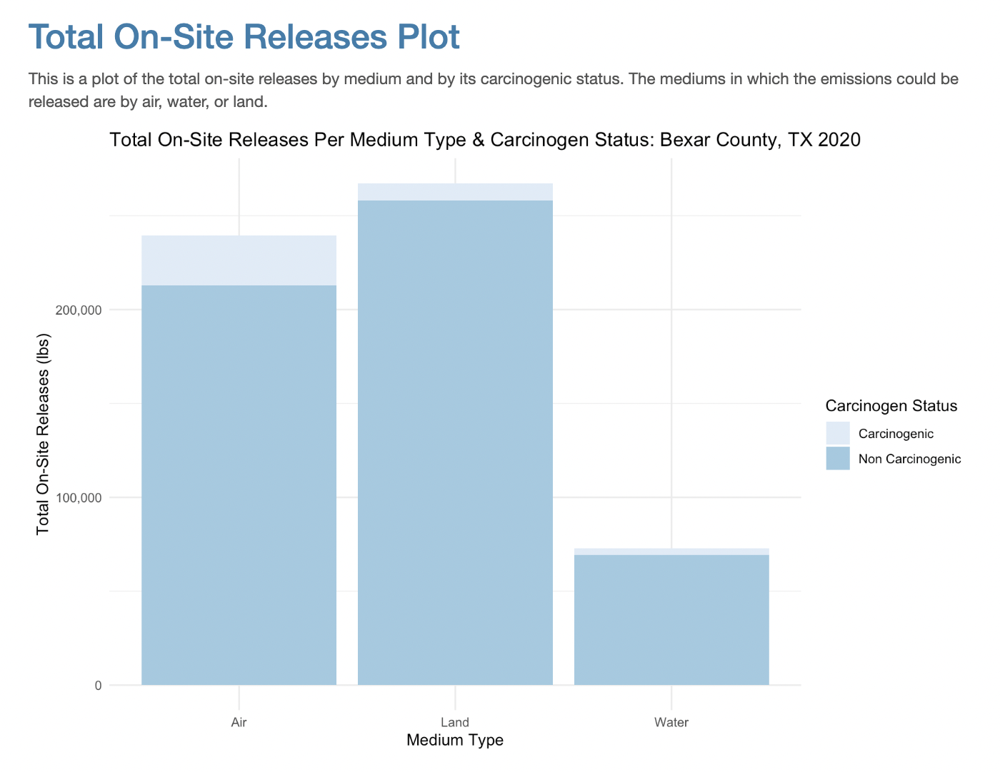

> Analyze multiple data sources to profile a "fenceline community" in the United States, the risks individuals in these communities are exposed to and the extent to which certain demographics are disproportionately exposed to those risks.

## Table of Contents

1. [TRI Data Analysis](#tri-data)
    
2. [2020 US Census Data Analysis](#census-data)
 
3. [Maps](#maps)

4. [Report](#report)

5. [Source](#source)

## 1. TRI Data Analysis
[Back to ToC](#toc)

## 2. 2020 US Census Data Analysis
[Back to ToC](#toc)

## 3. Maps
[Back to ToC](#toc) 

      
## 4. Report
[Back to ToC](#toc)

I chose to analyze Bexar county in Texas. After analyzing the “Who Is In Danger” data table, I found that the amount of facilities and the chemicals they were producing to be concerning. Producing high quantities of chemicals such as: Chlorine, Ammonia, and Sulfur Dioxide. These chemicals can be dispersed through air, water, and land. Due to these concerning amounts, I first wanted to identify the most polluting facilities and the extent of the chemicals they were emitting. Then, I wanted to analyze the communities within a dangerous range of these factories and the distribution and differences of health data amongst these communities. The health of the communities in Bexar county, Texas was measured with Coronary Heart Disease being the indicator. Furthermore, I wanted to analyze the distribution of People of Color in these communities to see if exposure to these harsh chemicals is disproportionately affecting marginalized groups. 
  
  I found that the most common release medium of emissions was air and land, with more than 75% of the total on-site releases being non-carcinogenic. However, the top 10 of those chemicals being dispersed was: barium compounds (except for barium sulfate (CAS No. 7727-43-7)),toluene, ammonia, manganese compounds, lead and lead compounds, n-butyl alcohol, zinc compounds, certain glycol ethers, 1,2,4-trimethylbenzene, and copper. I then did some geospatial analysis with maps. No conclusive correlations were found when plotting the percentage of People of Color in comparison to the total emissions in the county. However, after mapping the coronary heart disease data with the total emissions in the county, I drew some connections. The area surrounding San Antonio’s emission “hotspot” has higher amounts of coronary heart disease. Furthermore, the rates of heart disease get worse near large clusters of emission producing facilities.
	 
  An ethical concern that we should consider is about data privacy. Even though all of this data is publicly accessible, it can still violate people’s right to privacy. I was able to import data from the U.S. census by census tract and block group. These are very specific measurements of area. The more specific our lens is, the easier it is to identify the people who we are analyzing. We are also analyzing very private and personal health indicators such as heart disease, cancer, binge drinking etc. These data sets can do real harm to people, by having their data easily identifiable.

## 5. Source
[Back to ToC](#toc)

This project was a collaboration between Rachael An, Frankie Romeo, and Lily Ruddy.